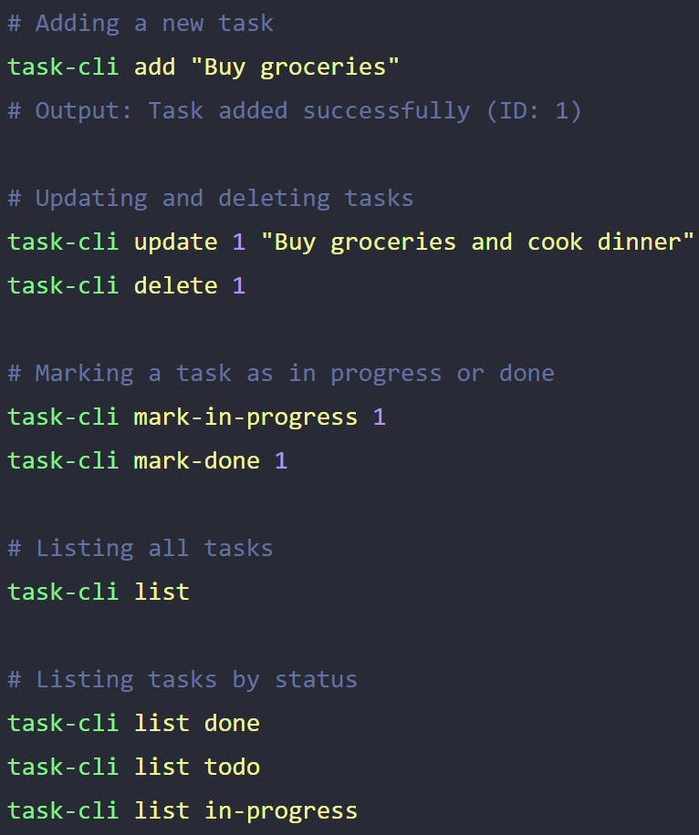

Here are some constraints to guide the implementation:

You can use any programming language to build this project.
Use positional arguments in command line to accept user inputs.
Use a JSON file to store the tasks in the current directory.
The JSON file should be created if it does not exist.
Use the native file system module of your programming language to interact with the JSON file.
Do not use any external libraries or frameworks to build this project.
Ensure to handle errors and edge cases gracefully.

Example
The list of commands and their usage is given below:

<!--  -->

Task Properties
Each task should have the following properties:

id: A unique identifier for the task 
description: A short description of the task 
status: The status of the task (todo, in-progress, done) 
createdAt: The date and time when the task was created 
updatedAt: The date and time when the task was last updated 
Make sure to add these properties to the JSON file when adding a new task and update them when updating a task.